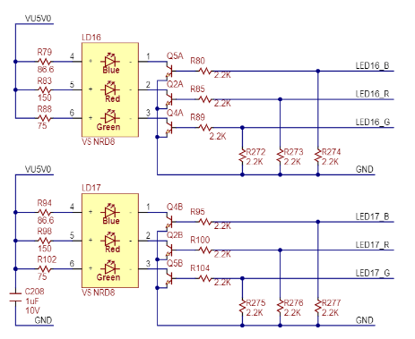
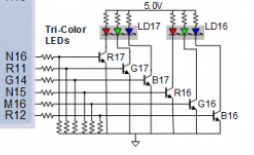

1. See [schematic](https://github.com/tomas-fryza/digital-electronics-1/blob/master/docs/nexys-a7-sch.pdf) or [reference manual](https://reference.digilentinc.com/reference/programmable-logic/nexys-a7/reference-manual) of the Nexys A7 board and find out the connection of two RGB LEDs, ie to which FPGA pins are connected and how. How you can control them to get red, yellow, or green colors? Draw the schematic with RGB LEDs.

| **RGB LED** | **Artix-7 pin names** | **Red** | **Yellow** | **Green** |
| :-: | :-: | :-: | :-: | :-: |
| LD16 | N15, M16, R12 | `1,0,0` | `1,1,0` | `0,1,0` |
| LD17 | N16, R11, G14| `1,0,0` | `1,1,0` | `0,1,0` |

2. See [schematic](https://github.com/tomas-fryza/digital-electronics-1/blob/master/docs/nexys-a7-sch.pdf) or [reference manual](https://reference.digilentinc.com/reference/programmable-logic/nexys-a7/reference-manual) of the Nexys A7 board and find out to which FPGA pins Pmod ports JA, JB, JC, and JD are connected.
 
 
 
 Table 10.1. Nexys A7 Pmod pin assignments.
| Pmod JA	Pmod JB	Pmod JC	Pmod JD	Pmod XDAC |
| :-: | :-: | :-: | :-: | :-: | :-: | :-: | :-: | :-: | :-: |
| JA1: C17	JB1: D14	JC1: K1	JD1: H4	JXADC1: A13 (AD3P) |
| JA2: D18	JB2: F16	JC2: F6	JD2: H1	JXADC2: A15 (AD10P) |
| JA3: E18	JB3: G16	JC3: J2	JD3: G1	JXADC3: B16 (AD2P) |
| JA4: G17	JB4: H14	JC4: G6	JD4: G3	JXADC4: B18 (AD11P)|
| JA7: D17	JB7: E16	JC7: E7	JD7: H2	JXADC7: A14 (AD3N) |
| JA8: E17	JB8: F13	JC8: J3	JD8: G4	JXADC8: A16 (AD10N) |
| JA9: F18	JB9: G13	JC9: J4	JD9: G2	JXADC9: B17 (AD2N) |
| JA10: G18	JB10: H16	JC10: E6	JD10: F3	JXADC10: A18 (AD11N) |

